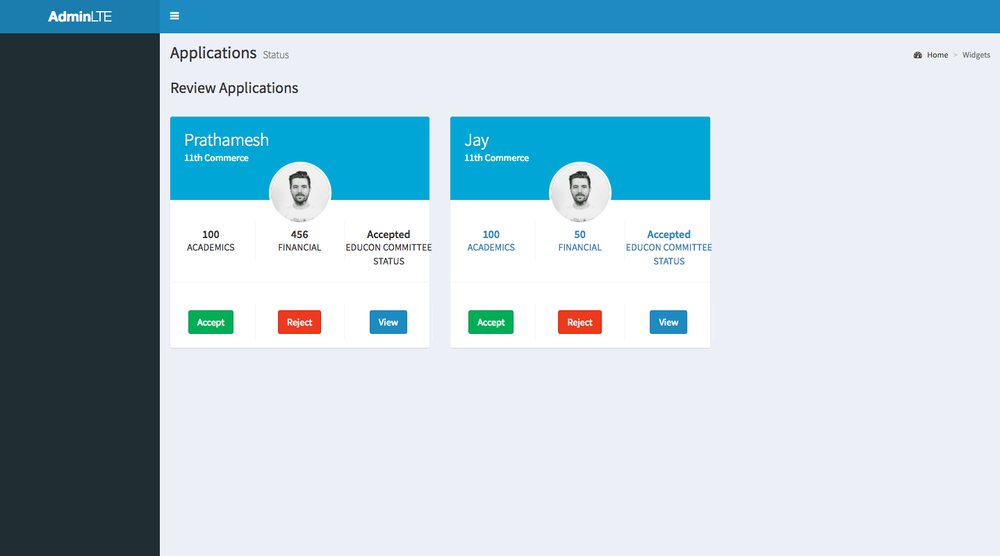
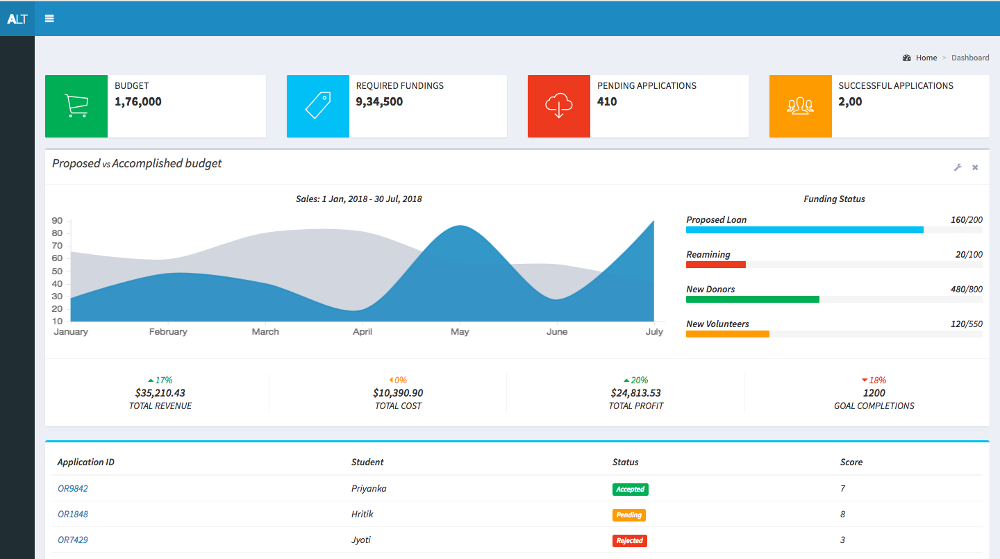

# Code for Good 2018 - Educon
Educon is a web based solution developed for the NGO Jain Social Group with a motive of semi-automating the entire process of providing donations to needy students. This solution was developed as a part of Code for Good 2018 organised by J. P. Morgan Chase & Co.

Jain Social Group is a Mumbai based NGO that aims in helping needy students by providing financial assistance for their ongoing education. Various such students register themselves with the NGO. The NGO finds potential donors for such students also giving the donor the independence to choose the student whom they would like to give financial assitance for the current year or throughout his or hers education life.

At this time this entire process is manual, volunteers from the foundation personally register the students and donors and maintain the records on excel sheets.
Other processes like verifying the student personally, passing the donation, funds management is also done manually by the volunteers and the committee members. 

To eliminate the manual process and provide a semi automated solution in this era of digitization, we have implemented some economical and feasible solutions that will help in smooth functioning of NGO processes.
Following are the features we have implemented:
* Feature 1
* Feature 2
* Feature 3

Link to Original Directory: [https://github.com/Mumbai18/team-7](Code for Good Mumbai 2018 - Team 7)

## Getting Started

* After cloning the project you need to import the project's database from DB Folder into phpmyadmin of your local machine.
* Modify the file assets/backend/connect.php according to your phpmyadmin credentials
* Now you are ready to run the project on your local machine.

### Setting up PHP Mailer

* Open the file in PHP Mailer/vendor/test.php
* Enter your Gmail Credential in the required section to enable the PHP Mailer functionality

### Prerequisites

* [Xampp PHP 5.6 or Above](https://www.apachefriends.org/download.html)
* [Gmail Email Id](https://www.gmail.com)

## Demo

### Login Page

### Profile Page

### Chat System for Online Counseling

### Attendance Tracking

### College E-Commerce

### Student-Teacher Forum

### E-books

### Live Streaming Lectures

### QR based Attendance

## Built With

* [EZ Web Player](http://www.ezwebplayer.com/)
* Admin LTE 2 Bootstrap Template

## Authors

* **Mandar Mhapsekar**-[mandar10](https://github.com/mandar10)
* **Prathmesh Mhapsekar**-[prathmesh36](https://github.com/prathmesh36 )
* **Raj Patel**
* **Aniket Mhatre**-[aniketm07](https://github.com/aniketm07)

## License

This project is licensed under the MIT License - see the [LICENSE.md](LICENSE.md) file for details

##### The code ("Code") in this repository was created solely by the student teams during a coding competition hosted by JPMorgan Chase Bank, N.A. ("JPMC").						JPMC did not create or contribute to the development of the Code.  This Code is provided AS IS and JPMC makes no warranty of any kind, express or implied, as to the Code,						including but not limited to, merchantability, satisfactory quality, non-infringement, title or fitness for a particular purpose or use.